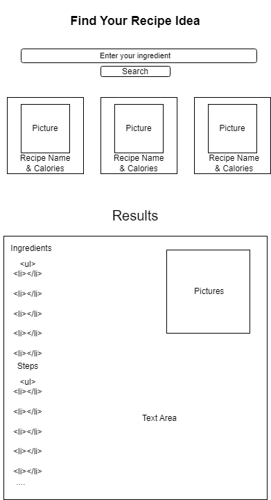

# Flavor Quest

This web application allows users to search for recipes based on ingredients. Users can enter ingredients into the search bar, and the app will display relevant recipes using the Edamam API.

## Usage

1. Enter ingredients into the search input field.
2. Click the "Search" button.
3. View the search results displayed below the search bar.

## Technologies Used

- HTML
- CSS
- JavaScript

## How It Works

- The user enters ingredients into the search input field and clicks the "Search" button.
- The app sends a request to the Edamam API, passing the user's search term as a query parameter.
- The API returns a list of recipes matching the search term.
- The app displays the recipe labels, images, ingredients, and links to the full recipes below the search bar.

## Credits

This web app was created by ***Vladimir***.

## Wireframe
 

